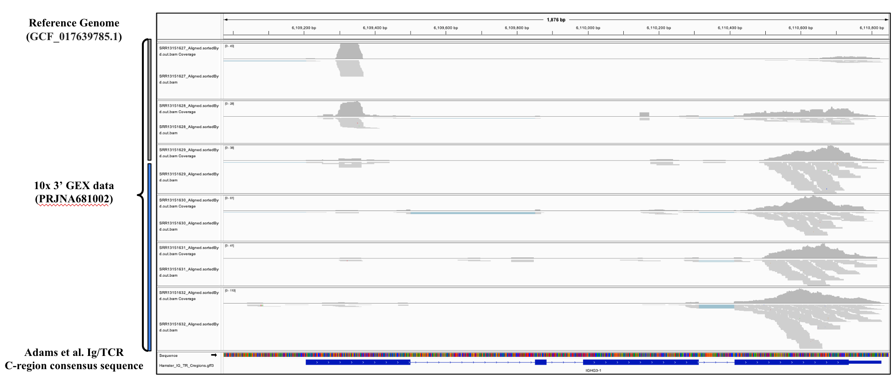
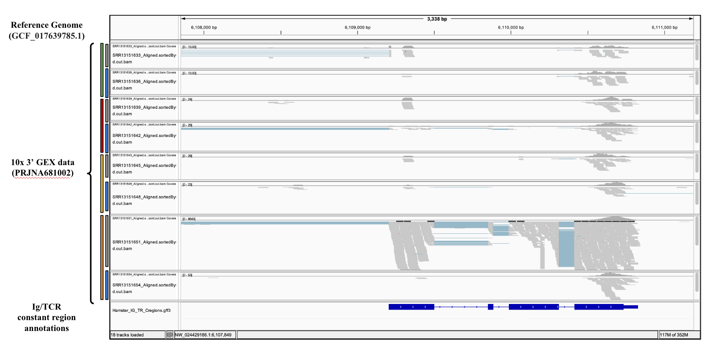

# Hamster 10x 3' GEX Data Alignment to Reference Genome
This folder contains alignment visualizations of 10x Genomics 3' gene expression data from Syrian hamsters used by Oliver et al. for Ig/TCR C-region consensus sequence generation, 
aligned to the hamster reference genome (**GCF_017639785.1**) using the **STAR** aligner. The goal of this analysis was to investigate support for the *IGHG3* C-region consensus sequence reported by Oliver et al., 
specifically for the intron retention event within CH2 (between exons 1 and 2). Our findings suggest there is no read support for this intron retention event, 
indicating that it is likely an assembly artifact.

## Data Summary
- **Bioproject:** [PRJNA681002](https://www.ncbi.nlm.nih.gov/bioproject/PRJNA681002)

### SRA Accessions and Conditions:
- **Uninfected tissues from all hamsters** :SRR13151627–SRR13151632
- **Infected tissues from just hamster 1 across all timepoints** : SRR13151633, SRR13151636, SRR13151639, SRR13151642, SRR13151645, SRR13151648, SRR13151651, SRR13151654.

---

## Figures
### Figure 1: Uninfected Tissues from All Hamsters

This figure shows the alignment of 10x 3' GEX data from **uninfected tissues** of all hamsters to the *IGHG3* locus in the reference genome. Lung and blood tissues are represented in **grey** and **blue**, respectively. No evidence of intron retention within the CH2 region is observed.

---

### Figure 2: Infected Tissues from Hamster 1 (All Timepoints)

This figure shows the alignment of **infected tissues from hamster 1** at different timepoints post SARS-CoV-2 infection. Lung and blood tissues are represented in **grey** and **blue**. Timepoints are color-coded as:
- **Green**: 2dpi
- **Red**: 3dpi
- **Yellow**: 5dpi
- **Orange**: 14dpi

Lung and blood tissues are shown in **grey** and **blue**, respectively. Across all timepoints and tissues, no evidence supports intron retention within the CH2 region of *IGHG3*, reinforcing that the previously reported retention is likely an assembly error.

---

## Conclusion
This analysis supports that the intron retention event within the CH2 region of *IGHG3* described by Oliver et al. is not supported by 10x 3' GEX data across uninfected and infected hamster #1 tissues. These findings suggest that the event is likely an assembly artifact.

---
